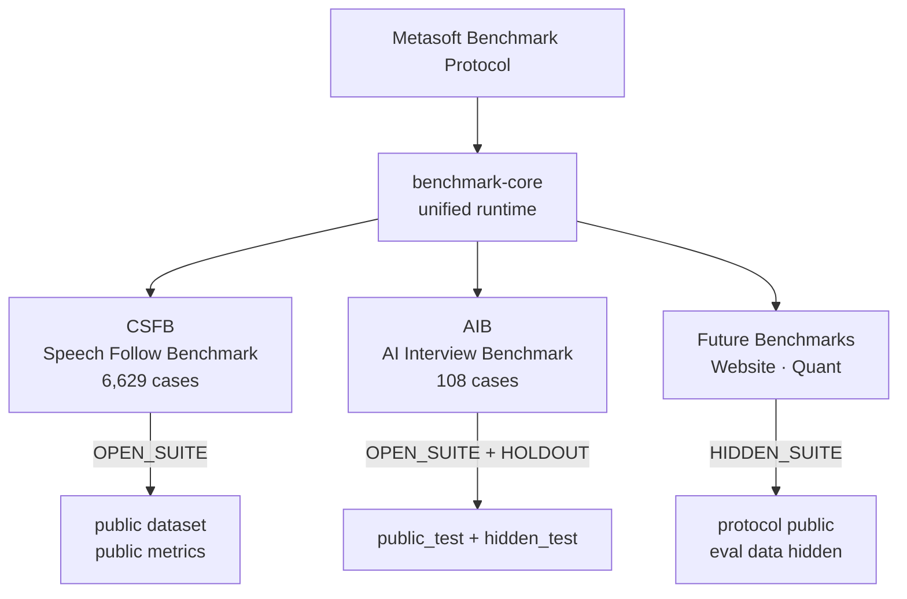

# Metasoft Benchmark Protocol

**AI System Evaluation Infrastructure**

Reproducible benchmarks for speech AI, interview AI, agent systems, and future AI applications. Not a leaderboard. Not a SaaS. A protocol, a shared runtime, and a methodology.

---

## Why MBP

AI systems are improving faster than evaluation methods. Every product claims "95% accuracy" — but against what dataset, what metrics, what failure modes?

MBP turns "how to measure" into a reusable engineering asset:

- **Protocol** — how to define, version, and freeze a benchmark
- **Runtime** — `benchmark-core`, a unified execution engine
- **Methodology** — dataset split, perturbation generation, invariance testing, hidden holdout

---

## Architecture



---

## Current Benchmarks

### CSFB — Speech Follow Benchmark

**Problem:** AI teleprompters need to track speech in real-time, handle skips, detect jumps, and recover from lost position. No standard existed to measure this.

- **Version:** v0.2.0-preview.1
- **Cases:** 6,629 (48,851 events)
- **Mode:** OPEN_SUITE
- **Metrics:** event accuracy, final accuracy, false jump, skip detection, recovery latency, by-language, by-region
- **Repo:** [Metasoft-cn/speech-follow-benchmark](https://github.com/Metasoft-cn/speech-follow-benchmark)

### AIB — AI Interview Benchmark

**Problem:** AI interview scoring systems are unreliable — scores drift across runs, keyword-match instead of understand, no evidence grounding. No benchmark tested the evaluator itself.

- **Version:** v0.2.0-preview.1
- **Cases:** 108 (24 curated + 60 generated + 24 invariance)
- **Mode:** OPEN_SUITE + HIDDEN_HOLDOUT
- **Methodology:** dataset split (train/dev/public_test/hidden_test), perturbation generator (paraphrase/verbosity/asr_noise), invariance test (6 groups), hidden holdout
- **Repo:** [Metasoft-cn/ai-interview-benchmark](https://github.com/Metasoft-cn/ai-interview-benchmark)

---

## Design Principles

| Principle | Why |
|-----------|-----|
| **Benchmark first** | You cannot improve what you cannot measure |
| **Freeze before compare** | Changing benchmarks invalidate comparisons |
| **Multi-dimensional** | Single scores hide failures |
| **Failure cases first** | Failures are actionable, success rates are not |
| **Invariance testing** | Keyword matching is not understanding |
| **Hidden holdout** | Public scores can be gamed |
| **Reproducibility** | Irreproducible results are anecdotes |
| **Separation** | Benchmarks measure, they do not prescribe |

See [`docs/BENCHMARK_PHILOSOPHY.md`](docs/BENCHMARK_PHILOSOPHY.md).

---

## Quick Start

```bash
git clone https://github.com/Metasoft-cn/metasoft-benchmark-protocol.git
cd metasoft-benchmark-protocol/benchmark-core
pip install -e ".[dev]"
pytest  # 38 tests
```

---

## Roadmap

| Phase | What | Status |
|-------|------|--------|
| 1 | benchmark-core unified runtime | ✅ Complete |
| 2 | AIB v0.2 methodology (split + perturbation + invariance + holdout) | ✅ Complete |
| 3 | Adaptive Speaking Engine (private) | Design phase |
| 3.5 | MBP Evaluation Cloud (private) | Planned |
| 4 | AI Website Benchmark | Planned |
| 5 | Quant Hidden Suite | Planned |

See [`METASOFT_BENCHMARK_ROADMAP.md`](METASOFT_BENCHMARK_ROADMAP.md).

---

## Repository Map

```
metasoft-benchmark-protocol/
├── SPEC.md, VERSIONING.md, REPRODUCIBILITY.md   — protocol
├── schemas/                                       — 5 JSON schemas
├── benchmark-core/                                — unified runtime (38 tests)
│   ├── examples/                                  — AIB + CSFB integration
│   └── tests/
├── docs/                                          — policies + philosophy + map
├── examples/                                      — open-suite + hidden-suite
├── articles/                                      — technical articles
└── METASOFT_BENCHMARK_ROADMAP.md                  — phase status
```

See [`docs/REPOSITORY_MAP.md`](docs/REPOSITORY_MAP.md) for details.

---

## Contributing

Read [`CONTRIBUTING.md`](CONTRIBUTING.md). Key constraint: `benchmark-core` API is frozen — add new functionality in the benchmark layer, not the core.

---

## License

[Apache-2.0](LICENSE). Schemas and specification text are Apache-2.0; benchmarks adopting MBP keep their own licenses.
